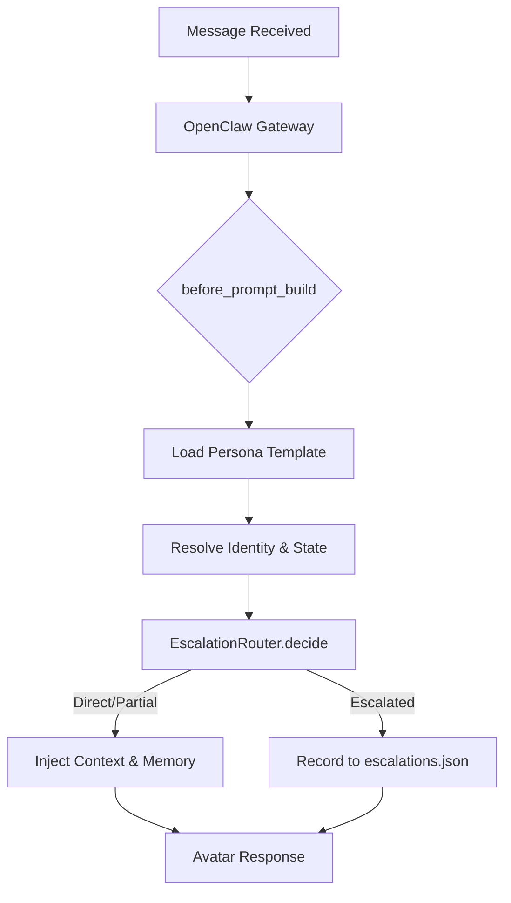

[English](README.md) | [中文](README.zh-CN.md)

# Ask Me First v1.1.0 — 个人数字工作分身 (Digital Avatar)

> 你的数字第一接触面：让分身先行，守护你的深度专注。

一套为 [OpenClaw](https://github.com/openclaw) 深度定制的生产级个人工作数字分身系统。它不再仅仅是简单的权限控制，而是在你与外界之间建立了一个具备人格特质、状态感知和决策能力的智能代理层。通过 **分身决策链 (Avatar Decision Chain)**，它能精准识别身份并根据你当前的实时状态替你承接、过滤或升级日常咨询。

## 功能介绍

每一条发给机器人的消息都会进入 `before_prompt_build` 钩子，通过完整的 **分身决策链** 处理：

1. **加载人格**：注入可自定义的人格模板 (`prompts/persona-system-prompt.md`)。
2. **识别身份**：通过会话映射或 `users.json` 确定发送者等级（管理员 / 成员 / 访客）。
3. **感知状态**：读取当前分身状态（在线 / 忙碌 / 专注 / 离线）。
4. **决策路由**：运行 `EscalationRouter.decide()` 产生最终决策：
   - ✅ **直接回答**：分身独立处理常规问题。
   - ⚠️ **部分回答**：根据信息等级进行上下文脱敏或过滤。
   - 🔺 **升级本人**：仅在紧急或必要时转接给本人，并记录至 `escalations.json`。
5. **上下文注入**：
   - **管理员**：获得完整项目上下文（git 提交、打开的文件、TODO）+ 长期记忆 (`MEMORY.md`)。
   - **普通用户**：根据权限获取经过滤的受限上下文。

## 架构



### 核心组件

- **AvatarController**：协调整个分身决策链。
- **StateDetector**：通过 Win32 API 实时分析前台窗口并集成飞书日历日程。
- **IdentityResolver**：将发送者 ID 映射为管理员、成员或访客，并维护动态信任分。
- **EscalationRouter**：基于角色、状态和关键字，决定是分身独立处理、部分回答还是升级。
- **ReplyFormatter**：将项目上下文和长期记忆根据权限注入分身人格模板。

## 快速开始

### 前置条件

- 已安装并运行 [OpenClaw](https://github.com/openclaw)
- Windows 系统（状态检测需调用 Win32 API）
- 已配置飞书/Lark 通道

### 安装

```bash
openclaw plugins install ask-me-first
```

### 手动安装

1. **克隆**项目到 OpenClaw 的 extensions 目录：
   ```bash
   cd ~/.openclaw/extensions
   git clone https://github.com/LENKIN233/ask-me-first.git
   ```

2. **配置身份**（可选 — 系统会自动将第一个发消息的人注册为管理员）：
   - 如需手动设置：编辑 `users.json`，将 `ou_your_admin_id_here` 替换为你的飞书 userId。
   - 根据需要调整 member/guest 条目。

3. **重启 OpenClaw Gateway**

### 首次启动

插件在首次加载时会自动执行：
- 创建 `~/.openclaw/workspace/ask_me_first/` 和 `ask_me_first/config/` 目录。
- 如果工作区尚不存在配置文件，则自动复制模板文件（`users.json`、`restricted-mode-prompt.txt`、升级规则等）。
- 绝不覆盖你已有的自定义配置。

**管理员零配置设置**：安装后第一个发送消息的用户将被自动注册为管理员。无需手动编辑 `users.json` —— 插件会识别模板中的占位符 `userId` 并将其替换为真实的飞书 userId。后续用户将根据 `users.json` 的配置解析为成员或访客。

### 验证

```bash
openclaw plugins list          # 应当显示 ask-me-first
openclaw plugins doctor        # 应当报告无错误
```

重启 Gateway 后，给你的机器人发送任意消息。第一个发送者将自动注册为管理员。接着可以尝试：

```
/avatar set coding
```

机器人应当回复确认信息，如 `✅ State overridden to: coding`。

## 项目结构

```
ask-me-first/
├── index.ts                      # 插件入口（Hooks、命令、服务集成）
├── openclaw.plugin.json          # 插件清单（配置 Schema、UI 提示）
├── package.json                  # npm 元数据 + OpenClaw 扩展声明
├── users.json                    # 用户身份映射模板（编辑后拷贝至工作区）
├── restricted-mode-prompt.txt    # 访客受限模式提示词模板
├── src/                          # 核心 TypeScript 源码
│   ├── controller.ts             # AvatarController 编排器
│   ├── state/                    # 状态检测（检测器、缓存）
│   ├── identity/                 # 身份解析与信任管理
│   ├── escalation/               # 升级规则引擎
│   ├── generation/               # 回复格式化
│   └── tools/                    # 日历、在离线、上下文、记忆工具
├── config/
│   ├── identities.json           # 身份等级定义
│   ├── escalationRules.json      # 升级规则配置
│   └── templates.json            # 回复模板
├── prompts/
│   ├── persona-system-prompt.md  # 富人格系统提示词模板 (New)
│   └── avatar-system-prompt.txt  # 基础分身系统提示词模板
```

### 目录模型

**代码仓库源码**（本仓库 / npm 包）包含模板和核心代码。
**运行时工作区**（`~/.openclaw/workspace/ask_me_first/`）是插件在运行时读写数据的地方：
- `users.json` — 当前活跃的用户身份数据
- `avatar_state.json` — 自动生成的状态快照
- `escalations.json` — 升级事件记录日志
- `config/escalationRules.json` — 活跃的升级规则
- `prompts/persona-system-prompt.md` — 活跃的人格模板
- `MEMORY.md` — 仅管理员可访问的长期记忆文件

首次启动时，插件会自动将模板文件从安装包拷贝到工作区的 `ask_me_first/` 目录（仅在文件不存在时执行）。

## 配置

### users.json

核心配置文件，定义权限边界：

| 身份类型 | 信息等级 | 斜杠命令权限 | 升级策略 |
|----------|-----------|----------------|------------|
| `admin`  | owner_only | 全部 (`*`)     | 无需升级       |
| `member` | internal   | 部分受限   | 部分升级    |
| `guest`  | public     | 无          | 自动升级       |

### 动态信任分系统

- 信任分范围：0.0 到 1.0。
- 衰减机制：自上次交互起，每天自动减少 0.01。
- 增益机制：每次确认有效的回复后增加 0.05。
- 信任分越高，分身开放的上下文权限越深。

### 状态感知

后台服务每 10 分钟自动检测一次你的当前活动：
- **前台窗口分析**：识别活跃应用（如 VS Code 对应 coding，Teams 对应 meeting）。
- **日历集成**：读取飞书日历日程。
- **显式覆盖**：通过 `/avatar set <state>` 命令进行手动干预。

### 升级规则

在 `config/escalationRules.json` 中配置：
- 关键词触发逻辑。
- 基于身份的路由规则。
- 状态感知决策（例如：在深度工作期间始终升级）。

## 核心特性

- **分身决策链 (Avatar Decision Chain)**：所有处理流转至 `before_prompt_build` 钩子，统一进行身份、状态和路由决策。
- **富人格系统**：通过 `prompts/persona-system-prompt.md` 模板，让分身具备真实的沟通语气和性格特质。
- **差异化上下文注入**：
  - **管理员**：完整的项目全景（Git、TODO、内存/文件上下文）和长期记忆系统。
  - **成员/访客**：经过权限过滤的受限信息集。
- **原生插件架构**：深度集成 OpenClaw，所有逻辑封装在 `index.ts` 中。
- **多维状态感知**：结合 Win32 窗口检测、飞书日历日程以及管理员强制命令 (`/avatar set`)。
- **动态信任分系统**：基于交互频率和回复有效性动态调整外部用户的访问深度（支持自动衰减）。
- **升级记录机制**：所有未处理或需要干预的请求将自动记录至 `escalations.json`。
- **智能初始化**：管理员零配置设置，安装后首个消息发送者即自动注册为管理员。

> ⚠️ **注意**：受限于 OpenClaw 的双模块隔离机制，`/avatar` 命令通过 `before_prompt_build` 中的指令重定向逻辑实现。暂时无法通过 API 拦截网关层的未授权斜杠命令。

## 限制与 API 稳定性

| 功能特性 | 依赖项 | 稳定性 |
|---------|-----------|-----------|
| `/avatar` 命令 | `registerCommand` | ✅ 稳定 — 核心插件 API |
| 首次启动初始化 | `register()` 生命周期 | ✅ 稳定 — 随插件加载运行 |
| 身份信息注入 | `before_prompt_build` 钩子 | ✅ 稳定 — 生产级支持 |
| 分身决策链 | `before_prompt_build` 钩子 | ✅ 稳定 — 核心逻辑链路 |
| 信任分追踪 | `message_received` 事件 | ⚠️ **实验性** — 依赖 OpenClaw 事件派发稳定性 |
| 自动注册管理员 | `message_received` 事件 | ⚠️ **实验性** — 依赖同上 |
| 状态检测服务 | `registerService` | ✅ 稳定 — 核心插件 API |

**如果 `message_received` 失效**：信任分将无法自动更新，自动注册管理员功能也将无法触发。此时请手动编辑 `users.json` 设置管理员 userId，信任分将保持初始值直至钩子功能可用。

## 文档

- [PITCH.md](docs/PITCH.md) — 项目完整介绍与设计初衷（中文）
- [IMPLEMENTATION.md](IMPLEMENTATION.md) — 原始设计文档（历史参考）
- [deployment.md](docs/deployment.md) — 生产环境部署
- [ops.md](docs/ops.md) — 运维手册
- [tuning.md](docs/tuning.md) — 性能调优

## 开源协议

MIT

## 备注

> ⚠️ 状态检测目前**仅支持 Windows**（通过 Win32 `GetForegroundWindow` 实现）。
